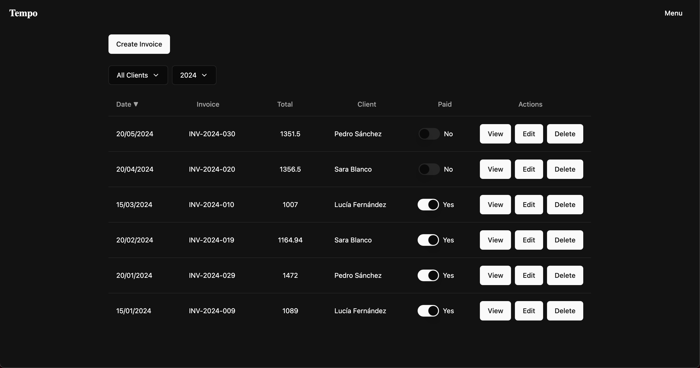
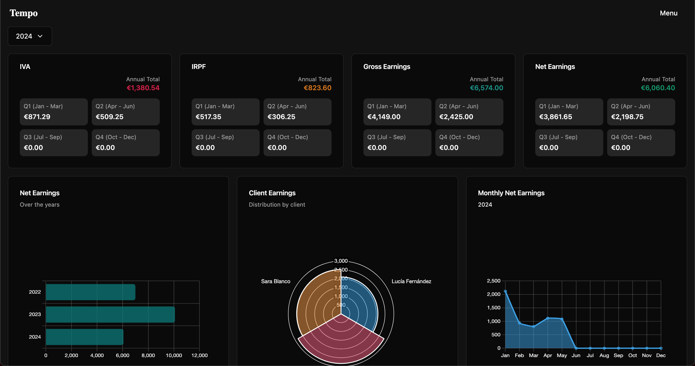

# Tempo

Tempo is a freelance assistant designed to help you manage clients and generate invoices with insightful analytics. Built using Angular, Tailwind CSS, Supabase, and Chart.js, Tempo provides a modern and responsive interface for efficient client management.

# Screenshots

## Further help

To get more help on the Angular CLI use `ng help` or go check out the [Angular CLI Overview and Command Reference](https://angular.dev/tools/cli) page.

## Copyright

Copyright 2024 [Ezequiel Gómez de Lima](https://github.com/ezequielgdl)

## License

This project is licensed under the MIT License.
